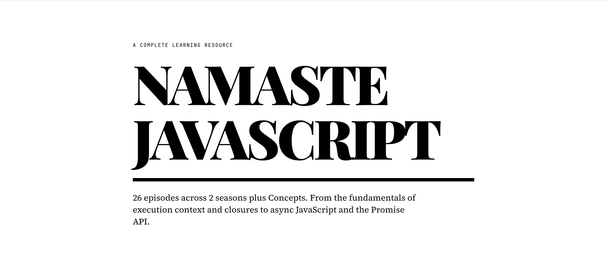

# Namaste JavaScript — Notes & Documentation

> Comprehensive JavaScript notes from the [Namaste JavaScript](https://www.youtube.com/playlist?list=PLlasXeu85E9cQ32gLCvAvr9vNaUccPVNP) series by Akshay Saini — written as real documentation, not just bullet points.

[](https://github.com/akshadjaiswal/Namaste-JavaScript/stargazers)
[](LICENSE)


---

## What you will learn

24 chapters covering JavaScript from first principles to advanced async patterns. Each chapter has an overview, detailed concept breakdowns, annotated code examples, interview questions with answers, and key takeaways.

**Season 1 — Core JavaScript**

- Execution Context & the Call Stack
- Hoisting, `var` / `let` / `const`
- Scope, Lexical Environment & Scope Chain
- Block Scope, Shadowing & the Temporal Dead Zone
- Closures — how they work, where to use them, when they leak
- `setTimeout` + Closure patterns (the classic interview question)
- First-Class Functions, Anonymous & Named Function Expressions
- Callbacks & Event Listeners
- Asynchronous JS, the Event Loop, Microtask Queue & Starvation
- V8 Architecture — Parsing, AST, JIT, Ignition, TurboFan, Orinoco
- Higher-Order Functions & Functional Programming
- `map`, `filter`, and `reduce` — with real examples

**Season 2 — Async JavaScript**

- Callback Hell & Inversion of Control
- Promises — states, `.then()` chaining, solving IoC
- Promise Chaining & Error Handling — `.catch()` placement, `.finally()`
- `async` / `await` — how suspension works, `try/catch`, parallel execution
- The `this` keyword — every context, `call`/`apply`/`bind`, arrow functions

---

## Read the Docs

The best way to go through this content is the **documentation app** — a full-featured reading experience with sidebar navigation, a table of contents, prev/next episode links, and syntax-highlighted code blocks.

**Live at: [namaste-javascript.vercel.app](https://namaste-javascript.vercel.app)**

[](https://namaste-javascript.vercel.app)

No setup needed — open the link and start reading.

---

## Content Map

Prefer reading on GitHub? Every chapter has its own `README.md`. Click any chapter below.

### Season 1 — Core JavaScript (19 chapters)

| # | Chapter | Topics |
|---|---------|--------|
| 01 | [Execution Context](./Chapter%2001%20-%20Execution%20Context/README.md) | Memory phase, code phase, GEC, two-phase execution |
| 02 | [Execution & Call Stack](./Chapter%2002%20-%20Execution%20and%20Call%20Stack/README.md) | LIFO, call stack trace, stack overflow |
| 03 | [Hoisting](./Chapter%2003%20-%20Hoisting/README.md) | `var` vs function hoisting, TDZ intro |
| 04 | [Functions & Variable Environments](./Chapter%2004%20-%20Functions%20and%20Variable%20Environments/README.md) | Per-call EC, isolated memory, return lifecycle |
| 05 | [Shortest JS Program, Window & `this`](./Chapter%2005%20-%20Shortest%20JS%20Program%2C%20Window%20and%20this%20Keyword/README.md) | Global object, `this` at global scope, `globalThis` |
| 06 | [`undefined` vs Not Defined](./Chapter%2006%20-%20Undefined%20vs%20Not%20Defined/README.md) | Placeholder value, ReferenceError, `null` vs `undefined` |
| 07 | [Scope & Lexical Environment](./Chapter%2007%20-%20Scope%20and%20Lexical%20Environment/README.md) | Scope chain, lexical scope, static vs dynamic |
| 08 | [`let`, `const` & TDZ](./Chapter%2008%20-%20let%20const%20and%20Temporal%20Dead%20Zone/README.md) | Block scope, TDZ, all error types |
| 09 | [Block Scope & Shadowing](./Chapter%2009%20-%20Block%20Scope%20and%20Shadowing/README.md) | Compound statement, shadowing rules, illegal shadowing |
| 10 | [Closures](./Chapter%2010%20-%20Closures/README.md) | Definition, module pattern, currying, memoization, memory leaks |
| 11 | [`setTimeout` + Closures](./Chapter%2011%20-%20setTimeout%20and%20Closures/README.md) | Loop problem, `var` vs `let` fix, IIFE solution |
| 12 | [Closures Interview Questions](./Chapter%2012%20-%20Closures%20Interview%20Questions/README.md) | 9 questions with full answers |
| 13 | [First-Class & Anonymous Functions](./Chapter%2013%20-%20First%20Class%20and%20Anonymous%20Functions/README.md) | Statement vs expression, named, anonymous, first-class |
| 14 | [Callbacks & Event Listeners](./Chapter%2014%20-%20Callbacks%20and%20Event%20Listeners/README.md) | Callback pattern, DOM events, GC & `removeEventListener` |
| 15 | [Async JS & Event Loop](./Chapter%2015%20-%20Asynchronous%20JS%20and%20Event%20Loops/README.md) | Web APIs, callback queue, microtask queue, starvation |
| 16 | [JS Engine & V8 Architecture](./Chapter%2016%20-%20JS%20Engine%20and%20V8%20Architecture/README.md) | Parsing, AST, JIT, Ignition, TurboFan, Orinoco GC |
| 17 | [Trust Issues with `setTimeout`](./Chapter%2017%20-%20Trust%20Issues%20with%20setTimeout/README.md) | Minimum delay guarantee, blocking the main thread |
| 18 | [Higher-Order Functions & FP](./Chapter%2018%20-%20Higher%20Order%20Functions%20and%20Functional%20Programming/README.md) | HOF definition, pure functions, declarative style |
| 19 | [`map`, `filter`, `reduce`](./Chapter%2019%20-%20map%20filter%20and%20reduce/README.md) | Each method explained with examples, chaining, reduce as both |

### Season 2 — Async JavaScript (5 chapters)

| # | Chapter | Topics |
|---|---------|--------|
| 01 | [Callback Hell](./Chapter%20S2%2001%20-%20Callback%20Hell/README.md) | Pyramid of Doom, Inversion of Control |
| 02 | [Promises](./Chapter%20S2%2002%20-%20Promises/README.md) | Promise states, `.then()`, solving IoC |
| 03 | [Promise Chaining & Error Handling](./Chapter%20S2%2003%20-%20Promise%20Chaining%20and%20Error%20Handling/README.md) | Chaining mechanics, `.catch()` placement, `.finally()` |
| 04 | [`async` / `await`](./Chapter%20S2%2004%20-%20async%20await/README.md) | Suspension model, `try/catch`, parallel with `Promise.all` |
| 05 | [`this` Keyword](./Chapter%20S2%2005%20-%20this%20Keyword%20in%20JavaScript/README.md) | All contexts, `call`/`apply`/`bind`, arrow functions, DOM |

### Concepts

| Topic | Description |
|-------|-------------|
| [Debouncing](./Concepts/Debouncing/README.md) | Delay execution until input settles — search boxes, resize handlers |
| [Throttling](./Concepts/Throtling/README.md) | Limit execution rate — scroll handlers, API rate limiting |

---

## Repo Structure

```
Namaste-JavaScript/
├── Chapter 01 - Execution Context/
│   └── README.md               # Chapter notes (rich documentation)
├── Chapter 02 - Execution and Call Stack/
│   └── README.md
├── ...                         # 19 Season 1 chapters total
├── Chapter S2 01 - Callback Hell/
│   └── README.md               # Season 2 chapters
├── ...                         # 5 Season 2 chapters total
├── Concepts/
│   ├── Debouncing/README.md
│   └── Throtling/README.md
├── Lectures Codes/             # Original JS code files from the lectures
│   ├── 01. Hoisting in Javascript.js
│   ├── 07 Closures in Javascript.js
│   └── ...                     # 23 code files
└── application/                # Documentation web app (Next.js)
    ├── app/
    ├── components/
    ├── lib/chapters.ts         # Reads chapter dirs at build time
    └── package.json
```

---

## Three ways to use this repo

**1. Use the live docs app** (recommended)
The best reading experience — sidebar, TOC, prev/next navigation, syntax highlighting. No setup.
**[namaste-javascript.vercel.app](https://namaste-javascript.vercel.app)**

**2. Read on GitHub**
Every chapter links directly above. Click any chapter in the Content Map and read the `README.md` in your browser — no account or setup needed.

**3. Study the code files**
The `Lectures Codes/` directory has the original JavaScript files from the lecture videos. Read a chapter's `README.md` alongside its corresponding code file for the deepest understanding.

---

## Original Course

All notes are based on the **Namaste JavaScript** YouTube series by [Akshay Saini](https://github.com/akshaymarch7).

- [Season 1 playlist](https://www.youtube.com/playlist?list=PLlasXeu85E9cQ32gLCvAvr9vNaUccPVNP)
- [Season 2 playlist](https://www.youtube.com/playlist?list=PLlasXeu85E9eWOpw9jxHOQyGMRiBZ60aX)

Watching the videos alongside these notes is the most effective way to learn.

---

## Contributing

Found a mistake or want to add notes for a topic not covered? Open an issue or submit a PR. All contributions are welcome.

If these notes helped you, a star on GitHub goes a long way.

---

<div align="center">

Made with care by [Akshad Jaiswal](https://github.com/akshadjaiswal)

[](https://github.com/akshadjaiswal)
[](https://linkedin.com/in/akshadsantoshjaiswal)
[](https://x.com/akshad_999)

</div>
